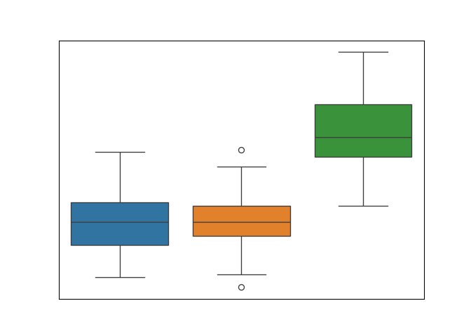

---
editor:
    render-on-save: true
---

# Una variable numérica por grupos

```{python}
#| include: false
import warnings
warnings.simplefilter(action='ignore', category=FutureWarning)
import pandas as pd
import seaborn as sns
# import matplotlib.pyplot as plt

url = "https://raw.githubusercontent.com/mwaskom/seaborn-data/master/penguins.csv"
penguins = pd.read_csv(url)
```

En la @sec-1numerical estudiamos la distribución del peso de todos los pingüinos del estudio. Ahora estudiaremos si hay diferencias en la distribución del peso dependiendo de la especie.

## El método `describe()` 


El método `describe()` que usamos en la @sec-1numerical-describe para obtener un resumen de la distribución del peso de todos los pingüinos, también puede aplicarse al peso agrupado por especies:


```{python}
penguins.groupby("species")["body_mass_g"].describe()
```

Vemos que obtenemos una tabla con el resultado combinado de aplicar el método `describe()` en el grupo de datos correspondiente a cada una de las tres especies.

Interpretamos los resultados en las columnas de rótulo `count`, `mean`, `50%` y `max`:


Fragmento de la salida | Significado
----- | ------
`count` | De la @sec-1categorical-describe sabíamos que hay $152$ pingüinos de la especie Adelie, $124$ de la especie Gentoo, y $68$ de la especie Chinstrap. Y de la @sec-1numerical-describe sabíamos que se desconoce el peso de dos pingüinos. Ahora sabemos que esos dos pingüinos son uno de la especie Adelie y otro de la especie Gentoo, y que se conoce el peso de todos los pingüinos de la especie Chinstrap.
`mean` | El peso medio de los pingüinos de la especie Gentoo es de $5$ kilogramos y $76$ gramos, superior a la media global de $4$ kilos y $201$ gramos (que conocíamos de la @sec-1numerical-describe). Y los pesos medios de las especies Adelie y  Chinstrap son inferiores a la media global y muy similares: $3$ kilos $700$ gramos, y $3$ kilos y $733$ gramos respectivamente.
`50%` | La mediana del peso es la misma para las especies Adelie y Chinstrap, $3$ kilos y $700$ gramos, y sustancialmente más grande, $5$ kilos, para la especie Gentoo.
`max` | El pingüino de mayor peso del estudio, con $6$ kilos y $300$ gramos, es de la especie Gentoo. Mientras que el peso máximo para las especies Adelie y Chinstrap no supera los $5$ kilos ($4$ kilos y $775$ gramos y $4$ kilos y $800$ gramos respectivamente).

::: {#exr-numerical_by_categorical-describe}
Usa los métodos `groupby()` y `describe()` para responder a las siguientes preguntas:

a.  Indica el peso medio de hembras y machos y compáralos con el peso medio global de $4$ kilos y $201$ gramos (que conocíamos de la @sec-1numerical-describe).
a.  ¿Cuál es el peso máximo de las hembras?
a.  ¿Cuál es la mediana del peso de los machos?
a.  El pingüino de mayor peso ¿es macho o hembra?
:::


## Histogramas 

En este apartado aprenderemos a construir diferentes histogramas para comparar la distribución del peso de las tres especies de pingüinos.

Para ello haremos uso de la opción `hue` de `histplot()`, que tiene el mismo efecto que vimos en la @sec-1categorical-by-countplot.


```{python}
sns.histplot(
    data=penguins, 
    x="body_mass_g", 
    hue="species" # <1>
);
```

1. Esta opción indica dividir en los tres grupos determinados por la variable especie, asignando un color diferente a cada uno, que se indica en la leyenda añadida al gráfico.


Vemos que los tres histogramas de las tres especies aparecen en capas superpuestas, lo que puede dificultar la distinción de los tres grupos. 


Para modificar esta disposición podemos hacer uso de la opción `multiple`.


### Histograma de barras apiladas

Para crear un histograma del peso distinguiendo la especie mediante barras apiladas ejecuta la siguiente instrucción:

```{python}
sns.histplot(
    data=penguins, 
    x="body_mass_g", 
    hue="species",
    multiple="stack" # <1>
);
```

1. Esta opción indica que queremos apilar las barras para cada grupo definido por la opción `hue` (en lugar de superponerlas como en el histograma anterior).

Observa que la forma del diagrama es la misma que la del histograma que se realizó en la @sec-1numerical-histogram. La novedad es que cada una de las barras que representa el número de pingüinos en cada uno de los intervalos de peso se ha fragmentado en tres barras indicando la contribución de cada especie. 

Ahora apreciamos mejor que conforme va aumentando el peso, va disminuyendo la contribución de las especies Adelie (azul) y Chinstrap (naranja), y aumentando la contribución de la especie Gentoo (verde).

::: {.callout-note}
Para crear un histograma de barras apiladas de una variable numérica por categorías, usa la función `histplot()` del paquete `seaborn` conforme aprendiste en la sección @sec-1numerical-histogram y además:

- indica el nombre de la variable que determina las categorías como valor del parámetro `hue`.
- usa `multiple="stack"` para que las barras de las diferentes categorías se muestren apiladas.
::: 


::: {#exr-histogram-stack}
Crea un histograma de barras apiladas para el peso de los pingüinos por sexo.
:::

### Histograma de barras separadas

Para crear un histograma del peso con barras separadas para cada especie ejecuta la siguiente instrucción:

```{python}
sns.histplot(
    data=penguins,  
    x="body_mass_g", 
    hue="species",
    multiple="dodge" # <1>
);
```

1. Esta opción indica que queremos barras separadas para cada grupo definido por la opción `hue`.


En este tipo de histograma fijándonos en las barras de un solo color vemos el histograma individual de la especie correspondiente. 

::: {.callout-note}
Para crear un histograma de barras separadas procede de la misma forma que para crear un histograma de barras apiladas pero cambia el valor del parámetro `multiple` a `"dodge"`.
::: 

::: {#exr-histogram-stack}
Crea un histograma de barras separadas para la longitud del pico de los pingüinos por sexo.
:::

<!-- ```{python}
sns.histplot(data=penguins,  x="body_mass_g", hue="species",
    # stat="count",
    multiple="layer"
);
``` -->

<!-- ```{python}
sns.histplot(data=penguins, x="body_mass_g", hue="species",
    # stat="count",
    multiple="fill"
);
``` -->


## Diagramas de caja y bigotes

<!-- Para acabar esta sección realizaremos el gráfico de la portada de este documento


en el que se representa un diagrama de caja y bigotes para el peso de los pingüinos de cada especie.  -->

En la @sec-1numerical-boxplot hicimos un diagrama de caja y bigotes para el peso de todos los pingüinos (sin distinguir la especie) con la instrucción

```{.python}
sns.boxplot(data=penguins, y="body_mass_g");
```


Para diferenciar por especie usamos la opción `hue` de `boxplot()`, que tiene el mismo efecto que para `countplot()` e `histplot()`:

```{python}
sns.boxplot(
    data=penguins, 
    y="body_mass_g",
    hue="species" # <1>
);
```

1. Dividir en los tres grupos determinados por la variable especie, asignando un color diferente a cada uno, según la leyenda.

Los dos puntos que aparecen resaltados con un círculo fuera de los bigotes en el diagrama de la especie Chinstrap (en naranja) son  __outliers__. El outlier por debajo del bigote inferior representa un pingüino de la especie Chinstrap con peso excesivamente bajo, y el outlier por encima del bigote superior se corresponde con un pingüino de la especie Chinstrap con peso excesivamente alto (excesivamente bajo/alto respecto a la distribución del peso en los pingüinos de la especie Chinstrap).

***

En los diagramas de barras creados con `countplot()` y en los histogramas creados con `histplot()`, indicamos la variable de interés en uno de los ejes, `x` o `y`; y  el otro eje se utiliza para el recuento de casos. Sin embargo en los diagramas de caja y bigotes, solo se utiliza el eje de la variable. Esto permite que podamos usar el eje sobrante para indicar una variable categórica, como en el siguiente ejemplo.

<!-- 
Así, una alternativa a `hue` para diferenciar por especie es añadir el argumento `x="species"` al gráfico de la @sec-1numerical-boxplot: -->

```{python}
sns.boxplot(
    data=penguins, 
    x="species", # <1>
    y="body_mass_g"
);
```

1. Distinguir las tres especies en el eje X.

Indicando la variable categórica como valor del parámetro `x` del eje libre,  obtenemos un gráfico similar al que obtuvimos usando `hue`,  pero con los nombres de las especies en el eje X en lugar de identificados por la leyenda de color. 

<!-- 
Para asignar un color diferente a cada especie añadimos `hue="species"`:
```{python}
sns.boxplot(data=penguins, x="species", y="body_mass_g", hue="species");
```


```{python}
sns.boxplot(data=penguins, y="body_mass_g", hue="species", gap=0.1);
```
El argumento `gap=0.1` reduce el tamaño de las cajas un $10\%$ para dar un poco de separación entre las tres cajas (por defecto `gap=0` y las cajas quedan pegadas).
 -->

::: {#exr-boxplots}
Realiza un gráfico que muestre los diagramas de caja y bigotes para el peso de las hembras y de los machos.

¿Aparecen outliers en alguno de los dos grupos?
:::
